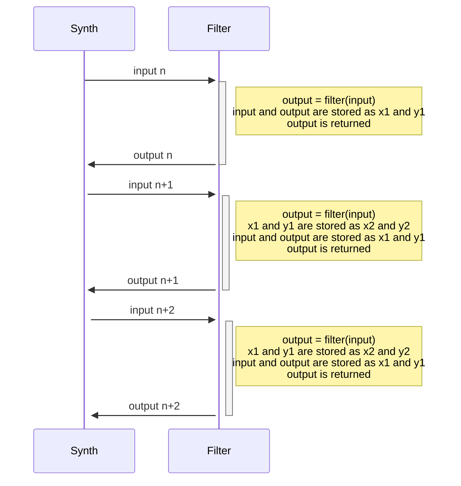

```mermaid
sequenceDiagram
    Synth->>+Filter: input n
    activate Filter
    note right of Filter: output = filter(input)<br/>input and output are stored as x1 and y1<br/>output is returned
    Filter->>+Synth: output n
    deactivate Filter
    Synth->>+Filter: input n+1
    activate Filter
    note right of Filter: output = filter(input)<br/>x1 and y1 are stored as x2 and y2<br/>input and output are stored as x1 and y1<br/>output is returned
    Filter->>+Synth: output n+1
    deactivate Filter
    Synth->>+Filter: input n+2
    activate Filter
    note right of Filter: output = filter(input)<br/>x1 and y1 are stored as x2 and y2<br/> input and output are stored as x1 and y1<br/>output is returned
    Filter->>+Synth: output n+2
    deactivate Filter
```