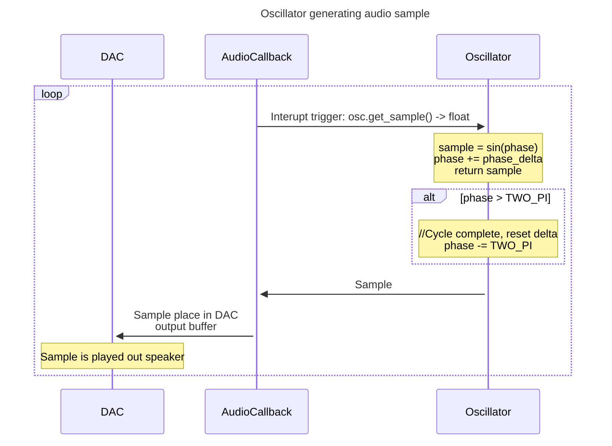

```mermaid
sequenceDiagram
    title Oscillator generating audio sample

    participant DAC
    loop
    AudioCallback->>+Oscillator: Interupt trigger: osc.get_sample() -> float
    Note over Oscillator: sample = sin(phase)<br/>phase += phase_delta<br/>return sample
    alt phase > TWO_PI
        Note over Oscillator: //Cycle complete, reset delta<br/>phase -= TWO_PI
    end 

    Oscillator->>+AudioCallback: Sample
    AudioCallback->>+DAC: Sample place in DAC<br/> output buffer
    Note over DAC: Sample is played out speaker
    end
```