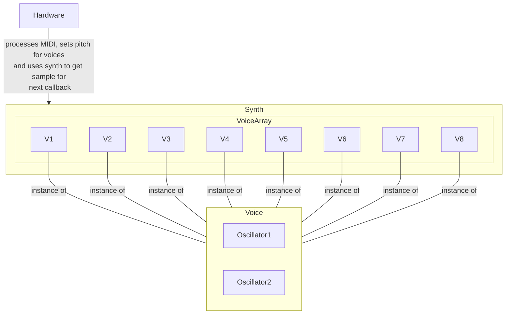

```mermaid
graph TB
    Hardware --> |processes MIDI, sets pitch for voices<br/>and uses synth to get sample for<br/> next callback| Synth

    subgraph Synth
        subgraph VoiceArray
            V1
            V2
            V3
            V4
            V5
            V6
            V7
            V8
        end
    end

    subgraph Voice
        Oscillator1
        Oscillator2
    end

    V1 --- |instance of| Voice
    V2 --- |instance of| Voice
    V3 --- |instance of| Voice
    V4 --- |instance of| Voice
    V5 --- |instance of| Voice
    V6 --- |instance of| Voice
    V7 --- |instance of| Voice
    V8 --- |instance of| Voice
```