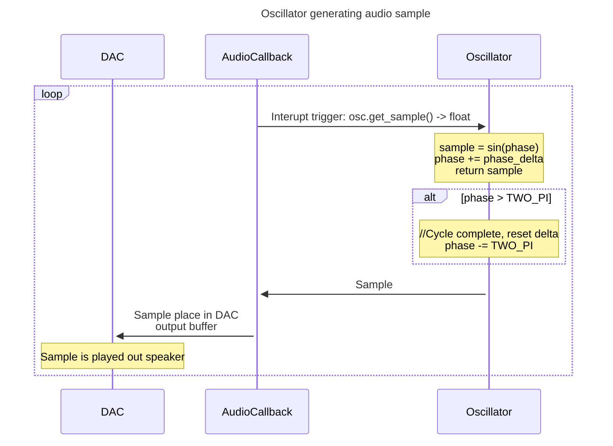
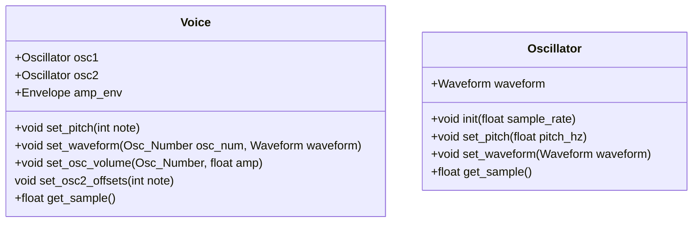

# UVU MCS Graduate Paper
### Candidate: Benjamin Stoneking
### Advisor: Dr. Frank Jones

# Abstract
The project focuses on implementing a real time digital audio synthesizer from the ground up on a micro controller. The aim is to leverage all the strengths of the microcontroller such as interupt service routines, timers and hardware interupts to produce a system capable of acting as a reliable musical instrument for the user. The topic is interesting as an exercise in implementing an audio data processing pipeline that involves many signal processing components such as oscillators, pitch control, gain mixing and attenuation, envelope processing and filtering to produce a variety of different sounds. The project represents building a complex system capable of being embedded in a limited processing space with options to extend its capabilities. The final project yielded a synthesizer meeting the fundamental requirements to be called a subtractive synthesizer: It can produce sound based off input from a midi instrument, can manipulate the signal gain to create an instrument capable volume dynamics. It can process the audio through high and lowpass filters to change the timbre to sound similar to real world instruments like guitars, pianos and string instruments and it has a hardware interface consisting of knobs, digital encoders and screen allowing the user to directly manipulate the sounds in real time. A computer software accessory application can communicate with the system to be able to adjust parameters, save and load user configurations for later use. Although the project meets minimum requirements for being a synthesizer, it has much work to be done. Many lessons were learned: the process of prototyping and implementing hardware peripherals can be fraught with frustrating bugs and failures. Embedded low level software has a much more involved and timeconsuming process for debugging, with regression tests being an absolute necessity. A lot of the funcionality of electronic musical instruments that we expect is a harder system to implement that expected. The lines of code for this system ended up around 2250 which is much lower than what is typically required of the project. Much of the reason for the smaller count of lines of code was because 1) Much time getting the system working required many if not tens of hours writing drivers to interface with hardware without the system regressing 2) More lines of code is not a good idea in an embedded system as it causes the firmware builds to grow and the microprocessors flash memory cannot contain all the instructions and 3) 50-100 hours of time was taken away from software development for prototyping hardware on breadboard and then designing and implementing permanent hardware fixtures with many setbacks and revisions required.

Keywords: audio, systhesis, embedded, microcontroller, real-time, midi, hardware, filters, envelopes


Begin with a proper thesis statement, which may be several paragraphs. A proper thesis statement answers the
following 4 questions:
(1) What problem are you trying to solve?
(2) why is it interesting?
(3) What are your major results?
(4) What are your conclusions?

# Introduction

The problem I wanted to solve was rather simple: The acquisition of musical gear is common obsession that plagues millions of musicians around the world. The cost of gear for performance or music production quickly drains the wallets of musicians who already struggle to keep their bank accounts at a non-zero value and for many musicians, this thought crosses their mind at least once: "Can I just make my own X and save some money?". If you ask anyone who has gone down the road of making their own digital software and music hardware, they will tell you the answer is "Yes you can just make your own X. No you won't save any money. You will spend more". Over the years, I've researched this very topic and found this conclusion to be true but with a small caveat: You _can_ in fact save money by making your audio effect of electronic instrument as a digital system rather than an electrical circuit of discreet analog components. This caveat has it's own caveat: if time is money, then every hour of time spent in implementing your system is implicitly adding to the price tag of your system.

I've known these facts for a long time and have seen it in action as my education has had me walk through the process of making yet another database management system, yet another virtual machine. Unsuprisingly, my database hasn't replaced MySQL and my virtual machine hasn't replaced the JVM. Still, so much knowledge and understanding of how computers work was gained from these experiences. I applied this same principle to my experience as a musician with the goal of my masters project: Make yet another digital synthesizer on an embedded microcontroller. The purpose is to learn how implement a complex realtime embedded system, develop a digital audio pipeline, make a hardware interface to control it and indulge my fantasy of making my own piece of musical gear. In order to maximize the learning potential of this project and focus in on the process rather than the final destination, I decided to set a few restrictions:

1. The firmware must be implemented in a low level language such as C/C++.
2. I can only use the standard C/C++ libraries and a Hardware Abstraction Layer library to minimize time wasted fussing with getting hardware peripherals communicating with the microcontroller.
3. No libraries means no DSP libraries. Every bit of audio data music be generated by instructions hand crafted by me. Although I can reference other digital audio codebases, I avoided it as much as possible to allow myself a chance solve the problem on my own for better or for worse.


The resultant product of my project turned out to be satisfactory but fell miles short of where I hoped it would be. I believe my project currently is in a place where it can be considered something that meets the basic requirements to be called a subtractive synthesizer. It's relatively stable, but with a few tweaks stands to be a studio or stange performance ready instrument for musicians.

# Concepts

## A quick word on audio synthesis and features required
Audio synthesis is a rather broad topic and a project goal of "make a synthesizer" is very vague. There are so many styles and methods of audio synthesis. Since this is my first jump into the world of real time data processing, I decided to make my synthesizer as classic as possible. The system I designed is a __subtractive__ synthesizer: fundamental waveforms are combined and then passed through a series of filters to strip away certain frequencies to create new sounds. This method is a relatively primitive yet classic means mimicking real world instruments and dates back nearly a century. Subtractive synthesis was made especially popular in the 60's and 70's for its ability to bring new and imaginative sounds to rock and jazz music. 

In order to make a digital subtractive synthesizer that meets the bare minimum requirements, I needed to implement the following features for my microcontroller:
1. Oscillators - produces an audio signal by repeating some pattern such as a sine wave at a set frequency
2. MIDI - __Music Instrument Data Interface__ or MIDI is the standard way that musicians communicate with electronic instruments and software. A common electronic piano keyboard usually has a MIDI out jack on it allowing the user to control other devices using the keys, knobs and buttons on their keyboard. My system needs to be able to receive generic MIDI messages commanding it to turn notes on and off in real time
3. In addition to MIDI capability, the system must have 8 voices, meaning it can play up to 8 notes at once. 8 is a rather arbitrary number but is generally an acceptable amount for most keyboard players. 
4. Filters - After oscillators, filters are the most critical component in a subtractive synthesizer as it allows the user to shape and mold their basic fundamental frequencies into new sounds.
5. Envelopes - After Oscillators and Filters, envelopes represent a critical component to a synthesizer. Envelopes are gates that may be triggered by arbitrary signal sources such as a key press on the keyboard and over time, the envelope gate will open and close over time. Most commonly, an envelope is applied to the output gain of a synthesizer allowing control of the volume which adds a great deal of strength to the synthesizers ability to mimick other instruments.

# Architecture

A big decision in implementing this project was choosing the right microcontroller platform. I considered several options but settled on a popular and relatively new audio development eco-system by Electro-Smith known as Daisy. Daisy is an Arm Cortex M7 based development board that provides all the necessary processing power and peripherals necessary for audio processing and then some. The Cortex M7 clocks at 480Mz peripheral support for an extremely high resolution digital to audio converter (DAC). In addition to the DAC, it has support for expected devices such as I2C, UART, USB, Timers etc. The biggest plus (at the time) to choosing Daisy as my platform was Electro-Smiths libDaisy library which acts as an abstraction on top of the standard HAL libraries for the Cortex M7. This was an attractive option as it would allow me to set up hardware quickly and allow me to focus primarily on the audio and signal processing aspects of the project. 


They also provide a DSP library which I chose to not use as an established requirement was not to use a DSP library and instead do all my own audio processing from scratch. As I mentioned before, Daisy seemed to be a great choice at the time and definitely freed up time in initial hardware setup. What I was not aware of was the relative newness of the platform. Daisy originally was a Kickstarter funded project which receive incredible amounts of success and support from customers. The platform was designed with musicians in mind, and they put a lot of work into supporting much more user friendly development languages and frameworks like MaxMSP, Puredata and Arduino to assist new developers in making their project and forgetting about all the gory details. Because of this additional layer of abstraction, it meant that a lot of time was put into customer accessibility and full support for utilizing all hardware to its fullest capabilities was put off and is still in current development. This had the following consequences for my project:

Some HAL library function did not work as they were supposed to. 
    a. One of the biggest disappointments was a lack of support for two way USB communication outside of the bootloader. When I was implementing my serial interfacing GUI application for remote control of my project, I discovered that the USB software support extended to either a dedicated interface for the device to either receive or transmit data over USB but not both. My choices were to either hack a software solution involving handing off control between the host computer and device, adding the two USB communication support to the libDaisy library (something that I did not have time or sufficient knowledge of USB to tackle) or simply add a USB-UART converter chip and connect it to some UART pins on the devices. I opted for the last option as I was severly lacking in time.
    b. Another severly lacking feature was support for hardware interupts. Some of the HAL library provided support for hardware interupts for USB receive (this felt insulting as I could not talk back on the USB line). But also, there was no support for UART and GPIO interupt service routines (ISR). This is the reason why MIDI data events are handled via periodic polling during timer ISRs. I believe this polling method yielded imperfect MIDI data consumption.
    c. A last gripe I have with the platform is the datasheet claiming availability of certain I2C and UART lines on the boards pins, but they are in fact not completely wired up in the boards current revision. This was not documented and instead made known to me via community forums. This lack of complete availability of hardware made adding all my peripherals rather difficult because of pin conflicts.
This whole experience soured me a bit to the Daisy platform in general. While I admire the ambition of the project to support programming in a variety of languages that opens up audio development to new developers, I feel it would have been best to fully flesh out all hardware support in basic C before moving on to supporting things like Object Oriented Programming, visual programming languages and Arduino. 

My original vision for the project was, as the masters capstone prompt recommend, **very ambitious**. My vision was to implement a near clone of my first synthesizer, the Korg microKorg, but as a headless unit that could be used by plugging in any standard MIDI keyboard (In my original design drawing, you can even see an array of buttons that represented a very limited keyboard which would allow the user to play notes without connecting an external keyboard. I truly was a bright eyed summer-child when I first envisioned this project).

I'll start the explanation fo my design first with the things that were complete, and then address the absent hardware and software features.

## Hardware

This section covers the hardware was successfully integrated into the project

### MIDI
There is a 5 pin MIDI input circuit that allows the user to connect a standard MIDI cable between the MIDI out of a standard keyboard and my synthesizer. This functionality is plug and play. By plugging in the MIDI cable and powering on the device, you can immediately start playing notes and making music which you can hear by pluggin in headphones or a speaker into the 1/8" audio jack. 

<div style="text-align:center">
    <p>Midi Circuit</p>
    
</div>

The MIDI circuit implements a standard of device safety for receiving incoming signals. An optocoupler receives signals and converts the incoming electrical signal from the MIDI line into an optical signal which can be read and converted to an electrical signal that is safe for the device. This safety precaution is meant to handle cases where the connected keyboard is malfunctioning or outputing an electical signal that is to high voltage for the pins on the MCU. It also acts as a much easier to replace component in the circuit. If there the keyboard is outputing voltage dangerously outside the expected voltage range, the optocoupler will fry and can be easily replaced instead of frying the MCU. 

### Analog Potentiometers and Screen

For adjusting parameters, I took a design philosophy of the Korg microKorg and setup an array of 5 analog potentiometers that had contextual control over various synth parameters which were determined by the internal state of the synthesizer. The internal state of the synthesizer is communicated to the user with a 20x4 character LCD display that shows the user the current mutable context of the system. 

<div style="text-align:center">
    <p>Photo Of Screen Main Menu</p>
    
</div>

For example, if the menu is displaying the oscillator control context, you can use the potentiometers to change the fundamental wave forms generated by the oscillators and set them as you like to a Sin, Triangle, Square, Sawtooth or Noise generator. If the menu was instead displaying the Amp Envelope control context, you can use those same knobs to adjust the Attack, Decay, Sustain or Release parameters of the envelope. The way the menu context is controlled is via a digital rotary encoder with a built in push button. Turning the knob will take the user out of their current control context into a universal menu of contexts that the user may control. They can turn the knob to highlight the component they wish to control (Filter, Envelope etc) and engage the encoder push button to transition to the control context of the highlighted component. The potentiometers would be mapped to adjust the fields within that context and perform specific interpolations of the components. Since some parameters are better controlled logarithmicly, the integer value read from the knob can be converted to a float and scaled according to its required range. Some parameters only represent a few discrete values. The large values of the 16 bit numbers would instead be mapped to the smaller ranges required to represent the discrete values of the menu parameter. 

<div style="text-align:center">
    <p>Photos of changing params</p>
    
</div>

### Power

The 20x4 LCD screen and the optocoupler on the MIDI input circuit require 5v, which Daisy does not put out (another frustrating aspect of the device since there is 5v power available on the USB jack of the daisy); so I added a standard breadboard power supply to the circuit accepts a barel jack input with voltages between 5v and 12v. This voltage is fed into the VIN pin on Daisy and is used to power the entire circuit and all its peripherals. A 1/8" inch stereo audio jack in connected to the left and right DAC pins on the MCU and outputs a signal at line level gain out of the box without the need of an amplifier (a very nice feature). Finally, there is a USB to Uart converter breakout board connected to a set of RX/TX UART pins on the MCU which allows two way communication between a computer and the synthesizer via a remote control GUI a wrote in Python.

### Audio DAC

Daisy has a built in high resolution digital to analog converter capable of outputting audio samples at rates up to 96khz and 24 bit depth which goes well beyond the industry standard quality of 44.1khz and 16 bit depth. There are four DAC channels: two for stereo input and two for stereo output. In this project, I only use the stereo output as processing audio input is beyond the scope of this project.

### UART, I2C and 16-bit input ADC

General purpose pins were configured to setup UART, I2C and ADC communications. Two separate UART lines were used for setting up MIDI input and plain serial communication for controlling the system remotely. The ADCs were used for reading the potentiometers. Some GPIO pins were used to read the digital rotary encoder for menu navigation.

<div style="text-align:center">
    <p>Diagram showing wiring of peripherals</p>
    
</div>

## Software

This section goes into depth of the various software components that make up the actual audio synthesis and processing. I will address the software components in the order that they were implemented over the course of the project, as it will also help to highlight the process of generating audio from the initial press of the eventual output of the audio to a speaker. I will cover the topics of Oscillators, Voices, Envelopes and Filters completely as these comprise the critical components of the actual synthesis aspects of the project. I will only very briefly discuss other features in a few sentences as they have less to do with audio synthesis and more to do with overall system cohesion and functionality.

### Oscillators

The most fundamental part of any subtractive synthesizer is the oscillator. Generally speaking, an oscillator is simply a function generator. The oscillator will maintain a variable representing the phase of the function cycle. The sequence chart below illustrates how audio samples are generated from the oscillator and then placed into the output buffer of the DAC when it triggers an ISR.



Note: The diagram above will generate a 1hz sin wave which isn't actually audible and we'd like to hear our music if possible. So the oscillator must maintain a variable containing the desired frequency and calculate our phase delta so we can actually generate the function at the desired frequency. **Phase delta** is a value by which we increment the phase in order to get the next sample of our waveform. To generate a wave at 1hz with a sample rate of 44.1kz, we simply need to divide two pi by 44100. Starting with our phase at zero, if we add our phase_delta to phase 44,100 times, we will have a value of two pi. Two change the pitch, we just need to multiply the phase delta by our desired frequency. If our pitch is set to 100hz, our calculated phase delta will allow our oscillator function to cycle 100 times in a second.

### What about other waveforms? Sin waves are boring.

This is true. Sin waves generally lack harmonic complexity and will generally produce very mellow tones. The oscillator class also maintains an enum describing what *kind* of oscillator it is. The oscillator wave form can bet set with the set_waveform method. Next time get_sample is called, the cooresponding waveform function will be called returning a sample from your fancy new harmonically rich waveform. For more information about this functions, the snippet below is a good start. Also see Oscillator.cpp for full source.

```c++
//Oscillator.h
enum WaveForm {
    Sin,
    Tri,
    Saw,
    Square,
    WhiteNoise,
    WaveFormEnd
};

//Oscillator.cpp
void Oscillator::set_waveform(WaveForm waveform)
{
    _waveform = waveform;
}

float Oscillator::get_sample()
{
    //Some context of this function removed for brevity
    switch (_waveform)
    {
        case WaveForm::Sin: {
            sample = sinf(_phase);
            break;
        }
        case WaveForm::Tri: {
            t   = -1.0f + (2.0f * _phase * TWO_PI_RECIP);
            sample = 2.0f * (fabsf(t) - 0.5f);
            break;
        }
        case WaveForm::Saw: {
            sample = ((_phase * TWO_PI_RECIP * 2.0f) * -1.0f) * -1.0f;
            break;
        }
        case WaveForm::Square: {
            sample = (_phase < _half_cycle) ? 1.0f: -1.0f;
            break;
        }
        case WaveForm::WhiteNoise: {
            sample = noise.process();
            break;
        }
        default: {
            sample = 0.0;
            break;
        }
    }
    //More context removed here for brevity
    return sample;
}
```

When the basic oscillator was set up and I was able to statically compile and upload code to make my little daisy output a continue 440hz sin wave, I felt a rush of excitement. It was incredibly gratifying to **hear** my code working instead of just seeing it in a terminal or GUI. I played around, writing little loops and time delays to change the pitch and hear the pitch change in real time and play scales. After that, I figured out the functions to generate the square function: a simple on/off function the sets the sample to 1.0 during the first half of the phase and the flipping it to -1.0 during the second half. Writing sawtooth and white noise functions was easy. I never was satisfied with the triangle waveform. Its supposed to stradle the line between a smooth sin wave and a choppy sawtooth in terms of complexity but it always sounded more like a slightly droopy sawtooth.

After the oscillators were properly implemented, I added the MIDI message processing through the MIDI UART connection. As MIDI messages came through the data line, the pitch data was parsed and converted into the note frequency in hz and the pitch was set on the oscillator. If a MIDI event message came through indicating that the note was released on the keyboard, the pitch of the oscillator was set to 0hz to silence the oscillator. At this point, I had the most bare minimum definition of a synthesizer. The user could play notes on the keyboard, and the configured oscillator waveform playing the cooresponding frequency would play out the speakers. But at this point, I could only play one note at a time and could not generate any signals more complex than the 5 basic oscillator functions. Adding polyphony and oscillator mixing was the next feature to add.

## Voices

In the world of synthesizers, single discrete note playing a certain pitch is called a voice. When your synth is monophonic, it means it only has one voice and can therefore only play one pitch at a time. Most modern synthesizers, whether analog or digital, have polyphonic capabilities. Many analog synthesizers can play four to eight notes at once, because adding more voices requires more discrete hardware oscillators and can make the system more complex, expensive and heavy. Digital synthesizers are able to accomodate more notes quite easily and will often support at least eight voices with options to play as many as 128 (the maximum number of discrete notes available in the MIDI protocol) which is quite overkill. I did a little bit of playing on a synthesizer of my own and payed attention to how many notes I needed at my most advanced and complex playing. I decided that eight would suffice with the option to add more if needed.

I wrote a class intended to capture the functionality of a voice. The class would contain two separate oscillators that can be set to any fundamental waveform. It would also contain separate gain parameters for attenuating or amplifying each individual oscillator. At the end of the processing chain for the voice, the attenuated oscillators would combined into one sample and passed to the classes output. Also included in the class is the option to configure a pitch offset to the second oscillator; another common synth feature in synthesizers. By detuning one oscillator from another, you can generate even more complex waveforms with frequency beating, added intensity or even complete disonance if desired.



Once this class was implemented, I wrote a larger class called synthesizer that would own a group of voice instances. As keys on the keyboard were pressed and released, the synthesizer would take a voice that didn't have a pitch set to 0hz and set the pitch to that note. Some optimization was made to ensure that if a voice wasn't in use, the synth class would bother telling the voice to generate a sample and waste resources on calculating the outputs of the oscillator functions. Implementing this opens a hole can of worms. What data structure should be used to hold these voices? There are many considerations to be made but first I just focused on making it work. For this project, I decided to avoid any C++ features other than simple classes and subclassing, as there would be performance and memory usage overhead prices to pay that would add up over time. I chose to use a primitive array. My approach was relatively simple. As a new note was played, I would iterate through the voices until I found a voice without a pitch set to 0, and set its pitch to the new note. When note off events come in, iterate over the array until the voice with a pitch matching the note off event is found and set it to 0. That was pretty easy. This was even quick to process. Most of the time you wouldn't have to iterate close to the end of the array.

The real rub was to handle when all voices were active and more note on events occurred. Should the synth just ignore that note, or should it drop some other note and replace it with the newest one? Most synths will change the pitch of the oldest voice in the sequence to be dropped from the note combination and use that voice to play the new incoming note. I decided to stay true to convention and implement this policy. Well the obvious first choice that came to mind was to use a stack. Push notes on to the stack and they're already sorted by the time they occured. So if there are too many notes being play, pop that voice off the back and push the new one Easy! Well it seems easy when you're just considering handling note on messages. But when note off messages occur, its very likely that the the voice that needs to turned off will be in the middle of the stack

Handling note off events was something I didn't expect would require so much work for the synth class to have to perform. When a note off event occurred, the synth would have to iterate over the voices in the array and find the voice playing the pitch that matched the note off event and deactivate the voice so it would stop generating a signal. At the time, I debated over using a modern C++ data structure like a map.  A map would have made short and easy work in managing this; but under the hood, I figured the STL library would have to be performing some form of iteration to locate the keys. The added memory usage and potential performance hit that could potentially stop samples from making it to the output buffer wasn't worth risking. 

A tricky part of this class was handling when more notes were being played by the keyboard than the synth had voices to play them.  As I implemented this functionality, I considered several methods. At first, I tried to keep the array sorted so that the first element in the array would be the note that has been present the longest. This required me to shuffle the voices in the array. This meant that if a ninth note was played, the first note would be popped off the front of the array, and the new note would be placed on the back of the array. Old notes at the front and youngest at the back. Seems simple right? Just use a stack, don't fuss with arrays! Well, the problem was that notes

## Envelopes

## Filters

## The little big software features

These are features that I would say are overlooked when they work, but utterly infuriating when they're broken. Some features were so important that they couldn't be ignored but sucked away a critical amount of time from the actual audio processing.

**The LCD Screen**
I setup I2C and wrote a driver to interface that allowed me to quickly print menu information to the screen. This was a tediously long process with a lot of trial and error and sucked up about 2-3 weeks of my time. But it works very well and was critical in implementing the menu system.

**The Hardware Timer**
I setup a hardware timer that triggered an ISR for reading peripherals. This effectively is a polling mechanism because of the lack of support for GPIO interupts in libDaisy. This timer callback would read the analog potentiometers, the rotary encoder, the MIDI UART line and respond to any inputs on these peripherals. This timer was also used to advance the state of the Amp Envelope (See envelope section for details).

**The Menu**
Running with the driver code for the LCD screen, I built up a class that will display the menu and their corresponding contexts.


